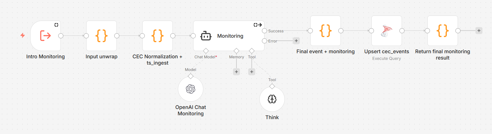
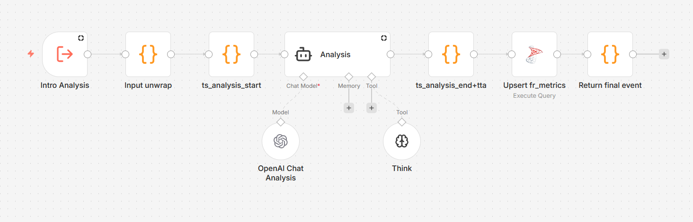

# orchestrator-n8n
## Orquestador de Agentes de IA para Gestión de Incidentes (SOC)

Prototipo de orquestación basado en **n8n** + utilidades **JS** para **ingesta, normalización (CEC), triage (LLM + HITL) y respuesta** ante incidentes de ciberseguridad (mapeo **MITRE ATT&CK**, playbooks y métricas como **MTTD/MTTR**).

> ⚠️ Proyecto orientado a desarrollo de prototipo de Laboratorio SOC. 
El prototipo consiste en un laboratorio levantado sobre una red distribuida con 2 laptops y 1 equipo de escritorio. Contiene varios servidores y clientes conectados a un router Huawei K562. La subred es 192.168.101.0/24. A continuación de detalla el laboratorio: 

## 🧪 Laboratorio SOC (topología)
El orquestador se valida en un laboratorio compuesto por **Wazuh Manager**, **Active Directory**, **n8n**, endpoints **Windows 11 / Ubuntu** e IDS **Suricata**

## ✨ Objetivos
- **Ingesta y normalización** de eventos a un **CEC (Canonical Event Schema)**
- **Triage automático** con LLM + **Human-in-the-Loop (HITL)**
- **Playbooks de respuesta** (bloqueo IP, notificaciones, registro IPs sospechosas)
- **Métricas operativas** (MTTD/MTTR)
  
## 🗃️ Esquema de Base de Datos
La base de datos fue levantada en Microsoft Sql 

Tablas principales:
- `cec_events`: evento normalizado + triage inicial
- `analysis_results`: resultados de análisis LLM (versionados)
- `response_plan`: plan de respuesta
- `hitl_decisions`: decisiones humanas
- `fr_metrics`: métricas consolidadas por `event_id`

## ✨ Objetivos
- Normalizar alertas a un **Canonical Event Schema (CEC)**
- Ejecutar triage automático con **LLM**
- Integrar **Human-in-the-Loop** para acciones críticas
- Ejecutar playbooks SOC de forma controlada
- Medir **MTTD**, **MTTR** y tiempos HITL
- Mantener trazabilidad end-to-end del incidente a través de la base de datos y los registros de n8n. 

## 🧱 Arquitectura

La arquitectura está diseñada bajo el patrón de diseño de división de roles con agentes especializados y orquestación centralizada por **agente supervisor** denominado **SOC Inspector Router**, responsable de:
- Interpretar la intención del usuario o alerta automática
- Seleccionar el **scope mínimo necesario**
- Orquestar workflows
- Aplicar contratos de datos y reglas anti-alucinación
El **SOC Inspector Router** se conecta con los **“agentes”**, que son implementados como workflows en n8n, mediante nodos **When Executed by Another Workflow** (llamadas tipo mcp*tool*)

El **evento CEC** es el contrato compartido entre todos los agentes y se enriquece progresivamente en cada etapa. > Ver detalles C1–C4 en: [`docs/10-architecture-c4.md`](docs/10-architecture-c4.md)

## 🔌 Flujo End-to-End

## 🔌 Cómo se conectan los flujos y los agentes (end-to-end)
**Cadena principal (simplificada):**

1) **Ingesta (Wazuh → CEC)**  
2) **Monitoreo / enrutamiento** (deduplicación, decisión de triage)  
3) **Análisis (LLM + reglas + HITL opcional)**  
4) **Plan de respuesta** (qué hacer)  
5) **Ejecución de respuesta** (hacerlo mediante acciones con: firewall/tickets/notificaciones)
6) **Resumen del evento**(Summarizer devuelve el evento json enriquecido con un resumen para el analista)
7) **Cierre y métricas** (MTTD/MTTR)

## 🛰️ Monitoring (ingesta + normalización)

Funciones:
- Normaliza alertas Wazuh a CEC
- Registra `ts_ingest` y `ts_ingest_ms`
- Calcula severidad (0–15), prioridad y riesgo (1–5)
- Genera `dedup_key`
- Inserta/actualiza `cec_events`
- Produce clasificación preliminar:
  - `monitoring_classification`
  - `monitoring_confidence`
  - `monitoring_summary`

## 🧠 Analysis (triage profundo)

Funciones:
- Registra `ts_analysis_start` y `ts_analysis_end`
- Análisis LLM con contexto SOC
- Clasificación final: `benign | suspicious | malicious`
- Mapeo MITRE ATT&CK
- Persistencia en `analysis_results`
- Actualización de métricas (TTA)

## 🧩 Response (planificación)

Funciones:
- Construcción de `response_plan`
- Selección de playbook:
  - `PB_NOTIFY_ONLY`
  - `PB_MALICIOUS_IP`
  - `PB_BLOCK_IP`
- Definición de opciones A/B/C
- Evaluación de `requires_approval`
- Guardrails: sin IP válida no se permiten acciones disruptivas
- Persistencia en `response_plan`

## ⚡ ResponseExecute + HITL

Funciones:
- Solicitud y registro de aprobación humana
- Ejecución de acciones
- Registro de `ts_response_start` y `ts_response_end`
- Cálculo de MTTR
- Persistencia en `response_execution` y `fr_metrics`

# 🧰 Tools operativas y de consulta

Las tools son workflows invocables directamente por el **Inspector**, sin ejecutar el pipeline completo.

## 🧨 Tool Operativa: Block / Unblock IP + port

Propósito: contención activa en firewall.

Entrada soportada:
- Texto libre (ej. `Bloquea la IP 1.2.3.4 puerto 8443`)
- JSON estructurado
- Evento Wazuh / CEC

Reglas:
- IP IPv4 obligatoria
- Acción: `block` o `unblock`
- Puertos permitidos: 22 y 8443
- Si el origen es Wazuh, se fuerza puerto 22

Salida:
- Estado `ok | error`
- Evidencia: stdout, stderr y código de salida

## 📊 Tool de Consulta: Query metrics

Propósito: consultas históricas y métricas SOC sin ejecutar el pipeline.

Ejemplos:
- Últimos incidentes
- MTTR por ventana temporal
- Métricas por `event_id`

Devuelve resumen y filas limitadas desde base de datos.

## 🧾 Tool de Consulta: Explain workflow

Propósito: documentación técnica dinámica.

Permite explicar workflows como:
- Monitoring
- Analysis
- Response
- ResponseExecute
- SOC Inspector Router

Incluye propósito, inputs, outputs y fallos comunes.

## 🧩 Tool de Consulta: List capabilities

Propósito: catálogo central del sistema.

Devuelve:
- Tools disponibles
- Workflows disponibles
- Nombres canónicos y aliases
- Contratos de entrada/salida

## 📏 Métricas

- **TTA**: `ts_ingest → ts_analysis_end`
- **MTTR**: `ts_response_start → ts_response_end`
- **HITL wait**: `ts_hitl_start → ts_hitl_end`

Persistidas en `fr_metrics`.

## 🗂️ Estructura del repositorio

Orchestrator/
├── workflows/
├── docs/
docs/
└── 10-architecture-c4.md

## 🚀 Ejecución (alto nivel)

1. Levantar n8n
2. Importar workflows
3. Configurar credenciales:
   - OpenAI
   - SQL Server
   - Telegram
   - Wazuh / SSH
4. Enviar alerta o comando SOC
5. Validar BD, notificaciones y métricas

## 📸 Créditos

Diagramas y capturas incluidos en `Orchestrator/docs/`.

## 📸 Créditos
Diagramas y capturas del laboratorio y flujos n8n incluidos en `Orchestrator/docs/`.
